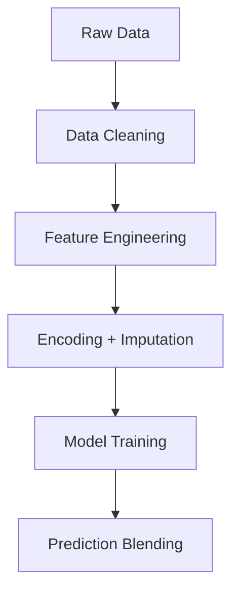

# 🚗 IEEE Jordan Modelthon - Used Car Price Prediction

A machine learning solution to predict optimal used car prices in Jordan, developed as a submission for the **IEEE Jordan Modelthon 1.0** competition.

---

## 📌 Project Overview

**Goal**: Predict sale prices of used cars in Jordan (JOD) based on historical listing data.  
**Challenge**: Jordan’s car market has unique variables—customs clearance, regional specs, Arabic labels—that need domain-specific handling.  
**Outcome**: Hybrid CatBoost-LightGBM model achieves **~7,000 JOD RMSE** on public leaderboard.

---

## 🛠️ How It Works

### 🔁 Data Pipeline


### 🧩 Components Breakdown

| Component        | Purpose                                | Jordan-Specific Insights                     |
|------------------|----------------------------------------|----------------------------------------------|
| Time Sorting     | Prevent future leakage                 | Sorted using `Scraped_Time` field            |
| Brand_Model      | Combine brand & model info             | e.g., "Toyota_Camry"                         |
| EV Handling      | Treat electric vehicles separately     | Set battery stats to 0 for non-EVs           |
| Target Encoding  | Capture city-wise price patterns       | "Amman" → 15,000 JOD average                 |

---

## 📂 Dataset Overview

### Files:
- `train.csv`: 10K+ listings with 33 columns
- `test.csv`: Same structure, without target variable

### Sample Features:
```yaml
- Condition: New/Used
- Regional_Specs: Middle East specs
- Car_Customs: Cleared/Not Cleared
- Kilometers: Odometer reading
- City: Amman, Zarqa, etc.
```

---

## 🧠 Model Architecture

We use a **hybrid regression approach**:

```python
final_prediction = 0.7 * CatBoost_prediction + 0.3 * LightGBM_prediction
```

### Why This Blend?

| Model     | Strengths                                  | Relevance to Jordan |
|-----------|--------------------------------------------|---------------------|
| CatBoost  | Handles categorical + Arabic features well | "سيارة" = car       |
| LightGBM  | Fast with numeric + tabular data           | Mileage/year trends |

---

## 🚀 Getting Started

### 📋 Requirements

```bash
pandas==1.5.3
catboost==1.2
lightgbm==3.3.5
category_encoders==2.6.0
```

### 📦 Installation

```bash
git clone https://github.com/yourusername/jordan-car-prices.git
cd jordan-car-prices
pip install -r requirements.txt
```

### 🏃 Run Model

```bash
# Train and validate
python src/model.py

# Predict on test set
python src/predict.py --input data/test.csv
```

Outputs:
- `submission.csv`: Final price predictions
- Console: RMSE scores + model logs

---

## 📊 Results

| Metric            | Value         |
|-------------------|---------------|
| Best CV RMSE (Log)| 0.58          |
| Public RMSE       | ~7,000 JOD    |
| Training Time     | ~45 minutes   |

---

